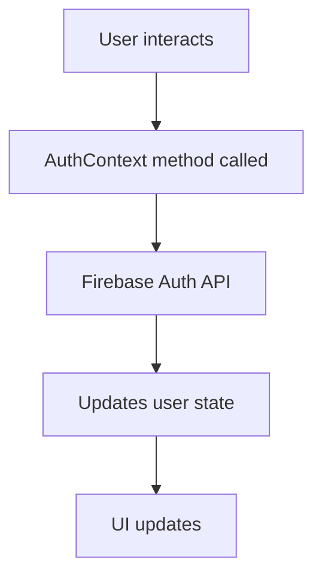
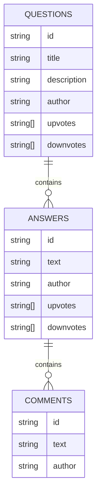
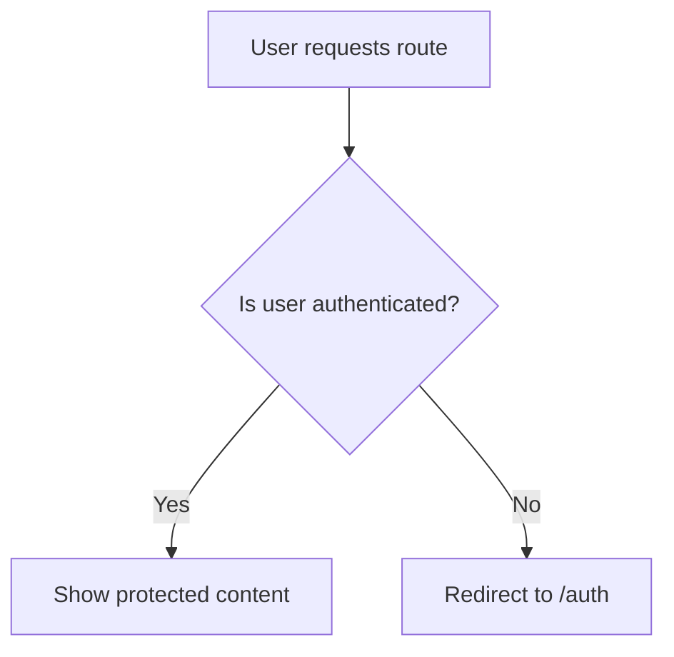
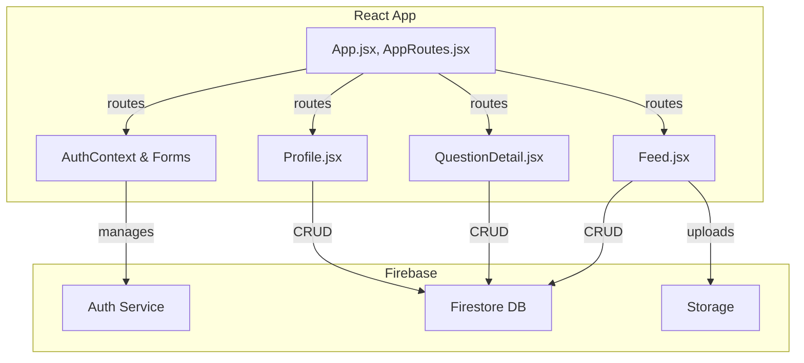

# Project Documentation

This documentation provides detailed explanations for each file in your React + Vite + Firebase Community Q&A Forum project. It covers the purpose, usage, and architecture, and employs tables, lists, code snippets, and diagrams where beneficial.

---

## `LoginForm.jsx`

Handles user login, both with email/password and Google authentication.

**Key features:**
- Collects email and password.
- Handles form submission and error display.
- Allows login via Google.
- Shows loading spinner during authentication.

```jsx
<form onSubmit={handleSubmit}>
  {/* Email and password inputs */}
</form>
<button onClick={handleGoogleLogin}>Login with Google</button>
```

| State                | Purpose                             |
|----------------------|-------------------------------------|
| email, password      | Store user input values             |
| error                | Display authentication errors       |
| loading              | UI feedback during async requests   |

---

## `SignupForm.jsx`

Handles user registration with email/password.

**Key features:**
- Collects registration details.
- Registers user and immediately signs them out (verification step or manual login required).
- Displays success or error messages.
- Google signup code is present but commented out.

| State                | Purpose                             |
|----------------------|-------------------------------------|
| email, password      | Registration input                  |
| error                | Shows registration errors           |
| success              | Shows success message               |
| loading              | Shows spinner on submit             |

---

## `AuthContext.jsx`

Provides authentication context and methods throughout the app.

**Key features:**
- Uses Firebase Auth for user management.
- Exposes: `signup`, `login`, `loginWithGoogle`, `logout`, `user`, `loading`.
- Listens for authentication state changes.

**Usage Example:**
```js
const { user, login, logout } = useAuth();
```

### Authentication Flow



---

## `firebaseConfig.js`

Initializes and exports Firebase services for authentication, Firestore, and storage.

- **`firebaseConfig`**: Firebase project settings.
- **`app`**: Main Firebase app instance.
- **`auth`**: Firebase Auth instance.
- **`db`**: Firestore database.
- **`storage`**: Firebase Storage.

---

## `Login.jsx`, `Signup.jsx`

These are simple wrapper pages for the login and signup forms.

```jsx
<LoginForm /> // in Login.jsx
<SignupForm /> // in Signup.jsx
```

Both provide a styled, centered form on a background.

---

## `Home.jsx`

Landing page for the forum.

- Welcomes users.
- Has a "Get Started" button navigating to `/auth`.

---

## `QuestionDetail.jsx`

Shows details of a single question, its answers, voting, and comments.

**Key features:**
- Fetches question data by ID.
- Fetches and lists answers (live updates).
- Allows users to upvote/downvote questions and answers.
- Allows users to add answers and comments.
- Handles paginated display and "see more/less" for long texts.
- Shows timestamps and author info.

| Feature                 | Implementation              |
|-------------------------|-----------------------------|
| Voting                  | Updates arrays in Firestore |
| Real-time updates       | `onSnapshot` Firestore      |
| Nested comments         | Subcollection in Firestore  |

### Data Structure (Simplified)



---

## `Feed.jsx`

Displays a feed of all questions.

**Key features:**
- Shows questions in a grid with infinite scroll.
- Allows authenticated users to ask new questions (inline form).
- Supports filtering by search, category, and tags.
- Real-time Firestore updates.
- Clicking a question navigates to `QuestionDetail`.

| Component                | Role                                 |
|--------------------------|--------------------------------------|
| Search                   | Filters by title/tags                |
| Ask form                 | Adds new questions to Firestore      |
| Infinite scroll          | Uses IntersectionObserver            |

---

## `AskQuestion.jsx`

Placeholder page for asking questions.

- Not used directly (the actual ask form is in `Feed.jsx`).

---

## `Auth.jsx`

Combined authentication page with tabbed navigation.

- Lets the user switch between Login and Signup without leaving the page.
- Renders the respective forms.

---

## `Profile.jsx`

Shows the logged-in user's profile, their questions, answers, and upvotes.

**Key features:**
- Shows user's email and upvote count.
- Tabbed view: "Your Questions" vs "Your Answers".
- Allows password change (with re-authentication).
- Lists user's questions and answers with meta-data.

---

## `AppRoutes.jsx`

Defines application routes and navigation bar.

- Uses React Router for routing.
- Navbar links change based on user authentication.
- Routes: Home, Ask, Profile, Login, Signup.

---

## `index.css`

Defines global styles and Tailwind CSS layers.

- Custom spinner loader animation.
- Loads Tailwind base, components, and utilities.

---

## `main.jsx`

Entry point of the React application.

- Wraps the app in `AuthProvider` and `BrowserRouter`.
- Imports global CSS.

---

## `App.css`

Loads Tailwind CSS base, components, and utilities for the application.

---

## `App.jsx`

Main application component and router.

- Contains a protected route wrapper to restrict access to authenticated users.
- Defines main navigation and all major app routes, including:
  - `/feed`, `/profile`, `/question/:id` (protected)
  - `/auth`, `/` (public)
- Redirects users based on authentication state.

### Protected Route Logic



---

## `firebase.json`

Firebase Hosting configuration.

- Specifies `dist` as the public directory.
- Ignores node_modules and dotfiles.
- Rewrites all requests to `index.html` (for SPA routing).

---

## `tailwind.config.js`

Tailwind CSS configuration.

- Sets the content paths to index.html and all source files.
- Allows custom theme extension and plugins.

---

## `README.md`

Default README from Vite's React template.

- Describes project setup and recommends expanding ESLint with TypeScript.

---

## `postcss.config.js`

PostCSS configuration for Tailwind CSS and Autoprefixer.

```js
export default {
  plugins: {
    tailwindcss: {},
    autoprefixer: {},
  },
}
```

---

## `eslint.config.js`

Configures ESLint for the project.

- Includes recommended rules for JS and React Hooks.
- Ignores `dist`.
- Enforces no-unused-vars (with variables starting with uppercase/underscore ignored).

---

## `index.html`

Main HTML template loaded by Vite.

- Loads root React app at `#root`.
- Loads main entry script.

---

## `vite.config.js`

Vite configuration file.

- Adds React plugin for Vite.
- Auto-configures for fast refresh and HMR.

---

## `.firebaserc`

Firebase project alias configuration.

- Sets the default project to `community-qna-forum`.

---

## `package.json` & `package-lock.json`

Node package configuration and lock files.

- Includes dependencies for React, React DOM, React Router DOM, TailwindCSS, ESLint, Vite and related plugins.
- Defines scripts for development, build, linting, preview.

```packagemanagers
{
    "commands": {
        "npm": "npm install",
        "yarn": "yarn install", 
        "pnpm": "pnpm install",
        "bun": "bun install"
    }
}
```

---

## `.gitignore`

Specifies files and folders to exclude from git tracking.

- Ignores logs, `node_modules`, build output, and IDE files.

---

# System Architecture



---

## Summary

This project is a modern community Q&A forum using React, Vite, Firebase, and Tailwind CSS. It provides a full-stack-like architecture entirely in the client, with real-time data and authentication. The modular file structure and context-based state management make it scalable and maintainable.

**Key highlights:**
- 🔒 Secure auth with Firebase.
- 🔥 Real-time Q&A feed and detail pages.
- 🎨 Responsive, Tailwind-powered UI.
- 📝 Well-organized, modular React codebase.

---